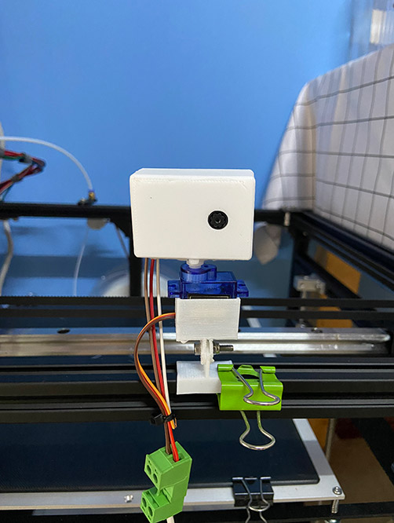
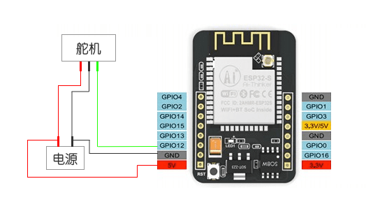

# esp32-cam
基于esp32-cam的一个项目  

## 功能
+ 本地监控 ✅
+ 远程监控 ✅
+ 摄像头旋转 ✅
+ 远程操控 ✅
+ Client界面优化 ❌
+ 帧率优化 ❌
  + 服务端数据缓冲
  + H5数据缓冲

## 目录结构
+ 3dmodel
  + 3D模型，整体框架连接与固定
+ board
  + 开发板相关代码
+ servers
  + 服务器相关代码
    
## 材料
+ ESP32-CAM 开发版
+ USB TO TTL下载器
+ 舵机（SG90）
+ 电源（5V 2A）
  + 我直接用普通手机充电器代替
+ 耗材若干
  + 如果没有3D打印机，整体框架可用胶水固定

## 开发工具
### ESP32开发
+ PlatformIO
  + https://docs.platformio.org/en/latest/core/installation.html
+ CLion 2020.3
  + https://www.jetbrains.com/clion/
  + 安装插件 platformio
### 服务端开发（go）
+ IntelliJ IDEA 2019.3.3
### 模型
+ OpenSCAD（建模）
+ Ultimaker Cura （切片）

## 使用
### Clone整个项目
```Shell
git clone https://github.com/guohuanwen/esp32-cam.git
```
### 运行服务器
项目分两种运行方式，主要区别是部署服务器在本地局域网还是远程机器上。
```Shell
# 需要安装GO环境
cd ./esp32-cam/servers
bash start.sh
 ```
#### 局域网运行
服务端部署在局域网内的一台电脑上，由于在局域网内，视频数据上传下载更快，帧数更加稳定，但是只能与单片机在同一个Wi-Fi环境下使用。
#### 远程运行
服务端部署在阿里云\腾讯云的机器上，受限于网络，帧数不稳定，服务器也需要成本，但是可以任何地方使用。
### 配置ESP32-Cam，编译并上传
+ ./esp32-cam/board/src 目录下新建config.h文件，文件内容如下
```c
//配置你的wifi名称和密码，配置2.4G的WIFI
#define WIFI_NAME "xxx"
#define WIFI_PASSWORD "xxxx"
//本地运行填写路由器给电脑分配的IP，远程运行填写服务器IP
#define WEBSOCKET_HOST "192.168.1.101"
//服务对应的端口
#define WEBSOCKET_PORT 8080
//视频流的socket地址，一般不用更改
#define WEBSOCKET_URL "/camera/uploader/ws"
```
### 编译项目
### 接线
  + ESP32-CAM 引脚  
    
  + ESP32-CAM 调试接线  
    
  + V1.1.0版本 接线  
    
    |  电源      | ESP32-Cam     | 舵机（SG90） |
    |  :-:     | :-:         | :-:  |
    | 5V       | 5V         | 5V  |
    | GND       | GND        | GND |
    |        | GPIO12       | Singal |
### 上传源码到ESP32-Cam
### 查看日志
```Shell
#terminal 执行
platformio device monitor
```
如果看到下面日志，则说明以上流程走通了
```
[WSc] Connected to url: xxxx
```
### 视频访问
浏览器打开 http://${服务端IP}/camera/client

## 技术点
+ 3D建模
+ 3D打印
+ Golang
+ Arduino/Esp32
+ Websocket
+ Html/JavaScript